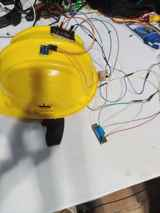

# Smart Helmet IoT System



An IoT-based smart safety helmet prototype built around ESP32 and multiple sensors for helmet-worn verification, motion/tamper monitoring, physiological sensing, temperature measurement, electrical monitoring, and local/wireless alerts.

## Features
- Helmet strap detection using reed switch + magnet
- Head/helmet presence verification using IR/proximity sensing
- Motion and tamper monitoring using MPU6050
- Heart-rate sensing using MAX30102
- Temperature sensing using DS18B20
- Voltage/current/power monitoring using INA219
- Buzzer and LED safety indication
- ESP32 wireless/BLE capability

## Hardware
| Component | Purpose |
|---|---|
| ESP32 | Main controller and wireless communication |
| MPU6050 | Motion/orientation sensing |
| Reed switch + magnet | Strap/fastening detection |
| IR/proximity sensor | Helmet/head presence detection |
| MAX30102 | Heart-rate sensing |
| DS18B20 | Temperature measurement |
| INA219 | Electrical parameter monitoring |
| Buzzer | Audible alert |
| LED | Visual status |

## Working
1. Check helmet strap status with the reed switch.
2. Confirm helmet/head presence with the proximity sensor.
3. Read motion from MPU6050 for abnormal movement/tamper logic.
4. Read physiological and temperature data.
5. Monitor electrical parameters with INA219.
6. Provide local feedback through buzzer/LED.
7. Use ESP32 wireless communication to transmit status when enabled.

## Repository
```text
smart-helmet-iot/
├── README.md
├── images/
│   └── smart_helmet_prototype.jpg
├── ESP32/
│   └── README.md
├── hardware/
│   ├── components.md
│   └── connections.md
└── .gitignore
```

## Important
Exact GPIO assignments are intentionally not guessed. Update the firmware with the verified pin mapping from the final assembled circuit.

## Future Improvements
GPS tracking, emergency notification, cloud/mobile dashboard, fall detection, battery monitoring, and a custom PCB/enclosure.

## Author
**Sarabjit Kumar** — B.Tech Electronics and Communication Engineering, Lovely Professional University
